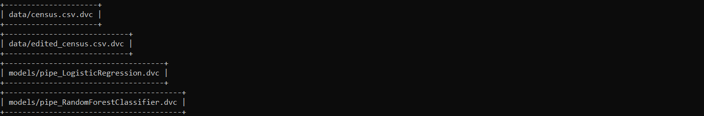
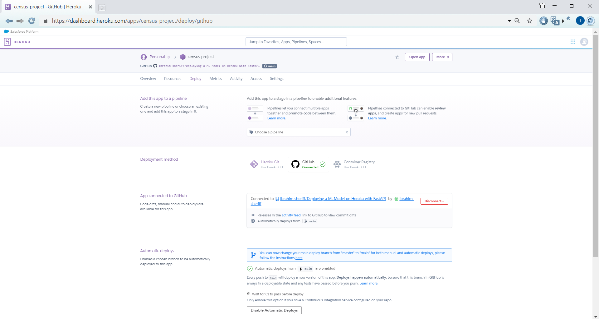
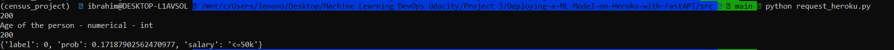

# Deploying-a-ML-Model-on-Heroku-with-FastAPI
The third project [ML DevOps Engineer Nanodegree](https://www.udacity.com/course/machine-learning-dev-ops-engineer-nanodegree--nd0821) by Udacity. Instructions are available in udacity's [repository](https://github.com/udacity/nd0821-c3-starter-code/tree/master/starter)

## Description
This project is part of Unit 4: Deploying a Scalable ML Pipeline in Production. The problem is to build a machine learning application that predicts an employer's annual income more than $50K using the census income [dataset](https://archive.ics.uci.edu/ml/datasets/census+income) from UCI. The application is deployed using FastAPI, with CI and CD using Github Actions and Heroku respectively.

## Prerequisites
- Python and Jupyter Notebook are required
- AWS account with S3 bucket 
- Github account to use Github Actions for CI
- Heroku account for CD
- Linux environment may be needed within windows through WSL

In addition to the following CLI tools
- [AWS CLI](https://docs.aws.amazon.com/cli/latest/userguide/install-cliv2-linux.html)
- [Heroku CLI](https://devcenter.heroku.com/articles/heroku-cli)
## Dependencies
This project dependencies is available in the ```requirements.txt``` file.

## Installation
Use the package manager [pip](https://pip.pypa.io/en/stable/) to install the dependencies from the ```requirements.txt```. Its recommended to install it in a separate virtual environment.

```bash
pip install -r requirements.txt
```

## Project Structure
```bash
📦Deploying-a-ML-Model-on-Heroku-with-FastAPI
 ┣ 
 ┣ 📂.github
 ┃ ┗ 📂workflows
 ┃ ┃ ┗ 📜main.yml           # Github Action yml file
 ┣ 📂data                   # Dataset folder
 ┣ 📂metrics                # Model metrics
 ┣ 📂models                 # Trained serialized models
 ┣ 📂notebooks              # EDA notebook
 ┣ 📂plots                  # Saved figures
 ┣ 📂screenshots            # Screenshots needed for the project other resources
 ┣ 📂src                
 ┃ ┣ 📂app                  # FastAPI folder
 ┃ ┣ 📂pipeline             # Model pipeline architecture and train functions
 ┃ ┣ 📂tests                # Testing functions
 ┃ ┣ 📜config.py            # Config file for the project
 ┃ ┣ 📜request_heroku.py    # Request from API deployed on Heroku
 ┃ ┗ 📜training.py          # Train model and generate metrics and figures
 ┣ 📜Aptfile                # Used for integrating DVC with Heroku
 ┣ 📜model_card.md          # Model card includes info about the model 
 ┣ 📜Procfile               # Procfile for Heroku
 ┣ 📜README.md              
 ┗ 📜requirements.txt       # Projects required dependencies
```
## Usage
The config file contains ```MODEL``` variable with a choice of either ```LogisticRegression``` or ```RandomForestClassifier```. Each model with a set of parameters for the grid search ```PARAM_GRID```. You can your own model with the parameters needed. The ```SLICE_COLUMNS``` variable holds the columns for slice evaluation.

1- Start training
```bash
cd src
python training.py
```
This saves a seralized model, generates evaluation metrics, slice evaluation metrics and figures,

2- Start FastAPI app
```bash
cd src
uvicorn app.api:app --reload
```

3- FastAPI app documentation to test the API from the browser
```
http://127.0.0.1:8000/docs
```


4- Testing the project
```bash
cd src
pytest -vv
```
5- Showing tracked files with DVC
```bash
dvc dag
```



6- CI using github action will be triggered upon pushing to github
```bash
git push
```

7- CD is enabled from within Heroku app settings



8- Starting the app on Heroku


9- Test deployment on Heroku, demo post request
```bash
python request_heroku.py
```



## License
Distributed under the [MIT](https://choosealicense.com/licenses/mit/) License. See ```LICENSE``` for more information.

## Resources

- Data and Modeling
  - [An article about the data and its ML application](https://medium.com/analytics-vidhya/machine-learning-application-census-income-prediction-868227debf12)
- ML Testing
  - [Made with ML Testing Lesson](https://madewithml.com/courses/mlops/testing/)
  - [Jeremy Jordan Article](https://www.jeremyjordan.me/testing-ml/)
  - [Eugeneyan Article about ML Testing](https://eugeneyan.com/writing/testing-ml/)
  - [Eugeneyan Article about Python Automation and Collaboration](https://eugeneyan.com/writing/setting-up-python-project-for-automation-and-collaboration/)
  - [mCoding video for automated testing](https://www.youtube.com/watch?v=DhUpxWjOhME)
- FastAPI
  - [Made with ML API Lesson](https://madewithml.com/courses/mlops/api/)
  - [FastAPI Tutorial](https://fastapi.tiangolo.com/tutorial/)
- Github Actions
  - [Made with ML CI/CD Lesson](https://madewithml.com/courses/mlops/cicd/)
  - [DVC with Github Actions](https://github.com/iterative/setup-dvc)
  - [AWS Credentials with Github Actions #1](https://github.com/marketplace/actions/configure-aws-credentials-action-for-github-actions#sample-iam-role-cloudformation-template)
  - [AWS Credentials with Github Actions #2](https://stackoverflow.com/questions/58643905/how-aws-credentials-works-at-github-actions)
- Heroku
  - [Procfile Tutorial](https://devcenter.heroku.com/articles/procfile)
  - [Integrate DVC with Heroku](https://ankane.org/dvc-on-heroku)


